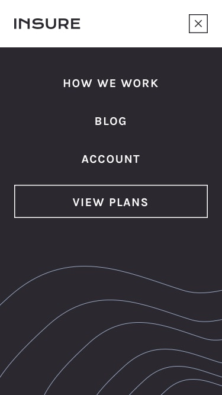

# Frontend Mentor - Insure landing page solution

This is a solution to the [Insure landing page challenge on Frontend Mentor](https://www.frontendmentor.io/challenges/insure-landing-page-uTU68JV8). Frontend Mentor challenges help you improve your coding skills by building realistic projects.

## Table of contents

- [Overview](#overview)
- [The challenge](#the-challenge)
- [Screenshot](#screenshot)
- [Links](#links)
- [Built with](#built-with)
- [Author](#author)
- [Acknowledgments](#acknowledgments)

## Overview

### The challenge

Users should be able to:

- View the optimal layout for the site depending on their device's screen size
- See hover states for all interactive elements on the page

### Screenshot

## Mobile

## Navbar Design

## Desktop

### Links

- [Github](https://github.com/Have-Samuel/insure-landing_page)
- [Live Site](https://have-samuel.github.io/insure-landing_page/)

## My process

### Built with

- Semantic HTML5 markup
- CSS custom properties
- Flexbox
- CSS Grid
- Mobile-first workflow

## Author

- [Github](https://github.com/Have-Samuel)
- [Frontend Mentor](https://www.frontendmentor.io/profile/Have-Samuel)
- [X](https://twitter.com/samhave1)
- [LinkedIn](https://www.linkedin.com/in/have-samuel/)

## 🤝 Contributing

Contributions, issues, and feature requests are welcome!

Feel free to check the [issues page](https://github.com/Have-Samuel/insure-landing_page/issues).

## Show your support

Give a ⭐️ if you like this project!

## Acknowledgments

- Thanks to Frontend Mentor 🎉
- 👋 Thumbs Up to [@Trekab](https://github.com/trekab)
- etc

## 📝 License

This project is [MIT](./MIT.md) licensed.
